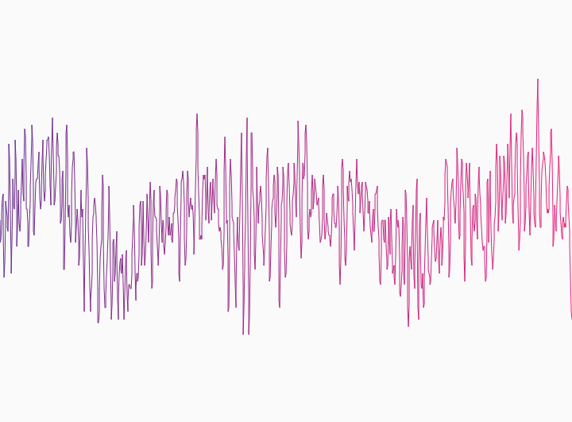
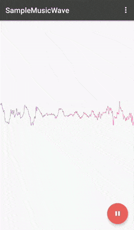

[](https://android-arsenal.com/api?level=9)

# MusicWave
With MusicWave represent your Sound in a gradient colored Visualization






Usage
-----

Add Permission in Manifest file.
```xml
 <uses-permission android:name="android.permission.RECORD_AUDIO"/>
```
xml
```xml
    <ak.sh.ay.musicwave.MusicWave
         android:id="@+id/musicWave"
         android:layout_width="match_parent"
         android:layout_height="match_parent"
         app:colorGradient="true"
         app:endColor="@color/colorEnd"
         app:startColor="@color/colorStart"
         app:waveThickness="1" />
```
For single color wave
```xml
         app:colorGradient="false"
         app:waveColor="@color/colorAccent"
```
Refer Sample App for detailed description of usage

Download
--------

 [  ](https://bintray.com/fxn769/android_projects/MusicWave/_latestVersion)  or grab via Gradle:
```groovy
compile 'com.fxn769:musicwave:1.0'
```
or Maven:
```xml
<dependency>
  <groupId>com.fxn769</groupId>
  <artifactId>musicwave</artifactId>
  <version>1.0</version>
  <type>pom</type>
</dependency>
```
or ivy:
```xml
<dependency org='com.fxn769' name='musicwave' rev='1.0'>
  <artifact name='musicwave' ext='pom' ></artifact>
</dependency>
```

Snapshots of the development version are available in [Sonatype's `snapshots` repository][snap].


## License
Licensed under the Apache License, Version 2.0, [click here for the full license](/LICENSE.txt).

## Author & support
This project was created by [Akshay Sharma](https://akshay2211.github.io/).

> If you appreciate my work, consider buying me a cup of :coffee: to keep me recharged :metal: by [PayPal](https://www.paypal.me/akshay2211)

> I love using my work and I'm available for contract work. Freelancing helps to maintain and keep [my open source projects](https://github.com/akshay2211/) up to date!

[](http://forthebadge.com)


 [snap]: https://oss.sonatype.org/content/repositories/snapshots/
